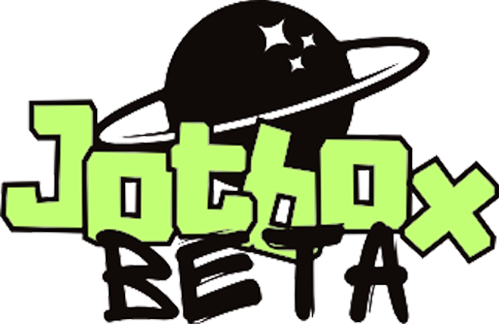

# JotBox

# 

JotBox is a modern, student-built note-taking application created entirely from scratch using HTML, CSS, JavaScript, and Python. This project is not based on any major libraries or front-end frameworks, making it lightweight, customizable, and a perfect learning opportunity. It is currently under development as part of my Personal Project for the final year of the IB MYP (Middle Years Programme).

The goal of JotBox is to provide a clean, simple, and intuitive user experience that is visually appealing and functional. It is designed with students in mind, offering a distraction-free way to create, manage, and store notes efficiently. I plan to complete and release the minimum viable product (MVP) by the end of summer.

## Technologies Used

The project uses the following core technologies:

- HTML5 and CSS3 for structure and styling
- JavaScript (Vanilla) for interactive behavior
- Google Fonts (Inter) for typography
- Python for backend logic (planned)
- GitHub for version control and hosting (For now I hope)

## Purpose and Goals

This project is being developed to demonstrate full-stack development skills and apply what I’ve learned in web development so far. It also serves as a key part of my school’s Personal Project requirement, allowing me to work independently on something I’m passionate about. JotBox is not just a school assignment, it’s a chance for me to create a real, usable tool while learning best practices in design, structure, and development.

My goal is to finish and publish JotBox by the end of the summer, with a fully functional interface, user system, and note-taking functionality.
License

This project is licensed under the MIT License. You are free to use, modify, and distribute the code, but please give proper credit.

### Author

JotBox is developed and maintained by chromeheartless. For updates, progress, or collaboration, feel free to reach out through GitHub.
